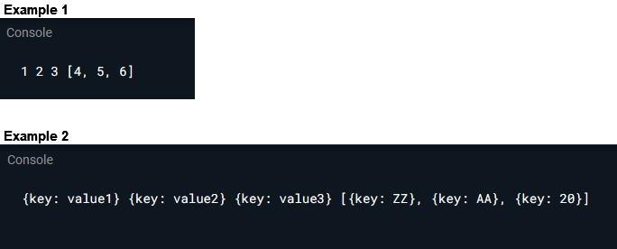

```dart
void main() {
  // * Example 1 - List<int>
  // final list = [1,2,3,4,5,6];

  // * Example 2 - List<Map>
  final list = [
    {'key': 'value1'},
    {'key': 'value2'},
    {'key': 'value3'},
    {'key': 'ZZ'},
    {'key': 'AA'},
    {'key': 20},
  ];
  final [a,b,c, ...d] = list;
  print("$a $b $c $d");
}
```

### Preview / Result


